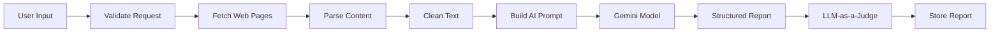

# API Documentation

The backend exposes RESTful APIs for authentication, report generation, and report history.

## Authentication APIs

### Register User

**POST** `/api/v1/auth/register`

Registers a new user.


---

### Login

**POST** `/api/v1/auth/login`

Authenticates an existing user and returns a JWT access token.

---

## Generate Market Intelligence Report

**POST** `/api/v1/research/generate`

> **Authentication Required**

Generates an AI-powered market intelligence report from the provided competitors, topics, and URLs.

---

## Report History

**GET** `/api/v1/research/history`

Returns previously generated reports for the authenticated user.

---

# Authentication Flow

The backend uses **JWT (JSON Web Tokens)** to protect secured endpoints.

Authentication workflow:

1. User registers or logs in.
2. Password is securely verified.
3. Backend generates a signed JWT.
4. Frontend stores the token.
5. Subsequent requests include:

```
Authorization: Bearer <JWT_TOKEN>
```

6. Protected endpoints validate the token before processing requests.

---

## Password Security

Passwords are **never stored in plain text**.

Instead, they are hashed using:

- PBKDF2-HMAC-SHA256
- Random salt generation
- Multiple hashing iterations

This approach provides strong resistance against brute-force and rainbow-table attacks while avoiding bcrypt's 72-byte password limitation.

---

# AI Research Pipeline

The intelligence generation process follows a multi-stage pipeline designed to improve both output quality and traceability.



---

## Step 1 — Research Intent

The user specifies:

- Competitor names
- Market topic
- One or more public URLs

These inputs define the scope of the market research.

---

## Step 2 — Content Extraction

Each supplied URL is fetched and processed.

The scraper extracts meaningful textual content while excluding irrelevant elements such as:

- Navigation menus
- Advertisements
- Headers and footers
- Scripts
- Styling information

This reduces noise before AI processing.

---

## Step 3 — Content Parsing

The extracted HTML is converted into clean text suitable for LLM input.

Typical preprocessing includes:

- Removing duplicate whitespace
- Normalising formatting
- Combining relevant sections
- Filtering empty content

The goal is to maximise the useful context sent to the language model.

---

## Step 4 — Prompt Construction

The cleaned research corpus is combined with the user's competitors and topic to construct a structured prompt for the AI model.

The prompt instructs the model to generate:

- Key themes
- Competitor activities
- Emerging trends
- Strategic observations
- Source-linked insights

Using a structured prompt improves consistency and readability of the generated report.

---

## Step 5 — Gemini Integration

Google Gemini is used to analyse the aggregated content and produce a structured market intelligence report.

The generated output includes:

- Executive summary
- Theme-based insights
- Competitor activities
- Supporting references
- Actionable observations

---

# LLM-as-a-Judge Verification

Large Language Models can occasionally generate unsupported or inaccurate claims.

To improve trustworthiness, the generated report undergoes an additional verification step using an independent LLM acting as a judge.

The verification process evaluates:

- Grounding of insights in the supplied sources
- Factual consistency
- Hallucinated statements
- Unsupported conclusions
- Overall confidence

Only verified outputs are returned to the user.

This additional validation layer helps improve the reliability of AI-generated market intelligence.

---

# Persistence

Generated reports are stored for future reference.

Persisting research enables users to:

- View previous analyses
- Reuse historical reports
- Compare results over time
- Avoid unnecessary regeneration

This also improves user experience by maintaining a history of completed research sessions.

---
