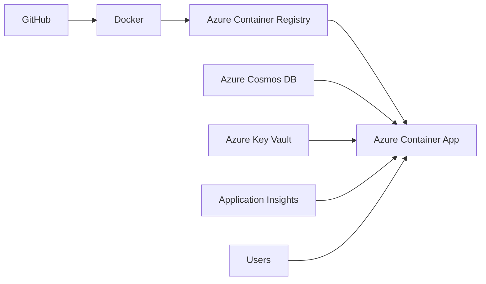

# Infrastructure

This document provides a high-level overview of the cloud infrastructure used to deploy the **Market Research Intelligence Assistant** backend on Microsoft Azure.

---

## Cloud Platform

The backend is deployed on **Microsoft Azure** using **Terraform** for Infrastructure as Code (IaC). The application is containerized using **Docker** and deployed as an **Azure Container App**.

---

## Azure Resources

The following Azure services are used:

| Service | Purpose |
|---------|---------|
| Azure Container App | Hosts the FastAPI backend application |
| Azure Container Registry (ACR) | Stores Docker container images |
| Azure Cosmos DB | Stores application data and generated reports |
| Azure Key Vault | Securely stores secrets and API keys |
| Azure Application Insights | Monitors application performance and telemetry |
| Azure Log Analytics Workspace | Collects and analyzes application logs |
| Azure Container Apps Environment | Provides the runtime environment for the container application |

---

## Azure Deployment

The following screenshot shows the Azure resources provisioned for the application.

---
## Infrastructure Diagram

---

## Deployment Highlights

- Infrastructure provisioned using **Terraform**
- Containerized deployment using **Docker**
- Backend hosted on **Azure Container Apps**
- Secrets managed using **Azure Key Vault**
- Data stored in **Azure Cosmos DB**
- Application monitoring with **Application Insights** and **Log Analytics**