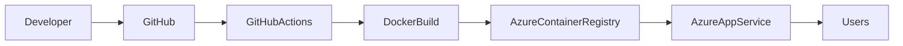

# Local Development Setup

## Prerequisites

Ensure the following software is installed before running the project locally.

| Software | Version |
|----------|---------|
| Python | 3.11+ |
| Git | Latest |
| Docker *(Optional)* | Latest |
| Terraform *(For Azure Deployment)* | Latest |
| Groq API Key | Required |

---

# Clone the Repository

```bash
git clone https://github.com/chandrika-suddamalla/MRI_backend.git

cd MRI_backend
```

---

# Create a Virtual Environment

### Windows

```bash
python -m venv .venv

.venv\Scripts\activate
```

### Linux / macOS

```bash
python -m venv .venv

source .venv/bin/activate
```

---

# Install Dependencies

```bash
pip install -r requirements.txt
```

---

# Configure Environment Variables

Create a `.env` file in the project root.

Example:

```env
APP_NAME=Market Research Intelligence Assistant

ENVIRONMENT=development

JWT_SECRET_KEY=<your_secret_key>

JWT_ALGORITHM=HS256

JWT_EXPIRATION_MINUTES=60

GEMINI_API_KEY=<your_gemini_api_key>

DATABASE_URL=<your_database_connection>

ALLOWED_ORIGINS=http://localhost:5173
```

> **Note:** Never commit secrets or API keys to version control. Store production secrets securely using Azure Key Vault or another secret management solution.

---

# Run the Application

Start the FastAPI development server.

```bash
uvicorn app.main:app --reload
```

By default the API will be available at:

```
http://localhost:8000
```

---

# Interactive API Documentation

FastAPI automatically generates OpenAPI documentation.

### Swagger UI

```
http://localhost:8000/docs
```

### ReDoc

```
http://localhost:8000/redoc
```

These interfaces can be used to test APIs during development.

---

# Running Tests

Execute the test suite using:

```bash
pytest
```

The test suite validates core application functionality and helps prevent regressions during development.

---

# Docker Deployment

A Dockerfile is included to simplify deployment and ensure environment consistency.

## Build the Docker Image

- The docker image is built using Github actions and pushed to Azure Container Repository
- The required secrets are stored in Github Secrets

---

The backend will now be available on:

```
http://localhost:8000
```

---

# Infrastructure as Code

Infrastructure provisioning is automated using **Terraform**.

Terraform enables consistent deployment of cloud resources without manual configuration.

Typical deployment resources include:

- Azure Resource Group
- Azure Container Registry
- Azure App Service / Container Apps
- Azure Key Vault
- Azure Storage (if configured)
- Networking components

---

## Terraform Workflow

Initialize Terraform:

```bash
terraform init
```

Preview infrastructure changes:

```bash
terraform plan
```

Deploy infrastructure:

```bash
terraform apply
```

Destroy infrastructure when no longer required:

```bash
terraform destroy
```

---

# Deployment

The backend is designed for deployment on **Microsoft Azure**.

Deployment workflow:



The deployment process consists of:

1. Push code to GitHub.
2. Build Docker image.
3. Push image to Azure Container Registry.
4. Deploy the container to Azure.
5. Configure application settings and secrets.
6. Expose the REST APIs for the frontend application.

---

## Environment Configuration

| Variable | Description |
|-----------|-------------|
| `APP_NAME` | Application name |
| `ENVIRONMENT` | Runtime environment |
| `JWT_SECRET_KEY` | JWT signing secret |
| `JWT_ALGORITHM` | JWT signing algorithm |
| `JWT_EXPIRATION_MINUTES` | Access token lifetime |
| `GROQ_API_KEY` | Groq API key |
| `COSMOS_ENDPOINT` | Azure Cosmos DB endpoint |
| `COSMOS_KEY` | Azure Cosmos DB primary key |
| `COSMOS_DATABASE_NAME` | Cosmos database name |
| `COSMOS_USERS_CONTAINER` | Users container |
| `COSMOS_REPORTS_CONTAINER` | Reports container |
| `ALLOWED_ORIGINS` | Allowed frontend origins |

This approach improves portability across development, testing, and production environments.

---

# Logging & Monitoring

The backend includes logging to assist with debugging and operational monitoring.

Typical events captured include:

- Authentication events
- Request processing
- Validation failures
- AI service errors
- Unexpected exceptions

Application logs can be integrated with Azure Monitor or other observability platforms for production deployments.

---

# Security Considerations

The backend follows several security best practices:

- Passwords are securely hashed before storage.
- JWT authentication protects private APIs.
- Secrets are externalised through environment variables.
- CORS is configured to allow trusted frontend origins.
- User input is validated using Pydantic models.
- Sensitive information is excluded from API responses.
- API keys are never hardcoded into the application.

These practices improve application security while keeping the implementation lightweight and appropriate for the assignment scope.

---