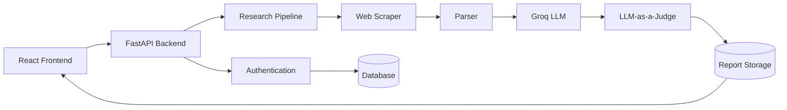
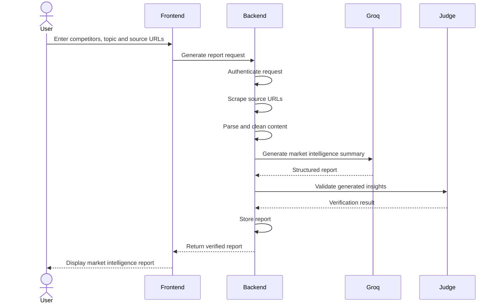

# Market Research Intelligence Assistant – Backend

Backend service for the **Market Research Intelligence Assistant**, an AI-powered application that helps Product, Strategy, and Go-To-Market (GTM) teams gather market intelligence from multiple public sources, generate structured summaries, and validate AI-generated insights using an LLM-as-a-Judge.

---

## Table of Contents

- [Problem Statement](#problem-statement)
- [Solution Overview](#solution-overview)
- [Assignment Objectives](#assignment-objectives)
- [Key Features](#key-features)
- [System Architecture](#system-architecture)
- [Application Workflow](#application-workflow)
- [Technology Stack](#technology-stack)
- [Project Structure](#project-structure)

---

# Problem Statement

Product and GTM teams continuously monitor competitors, product launches, blogs, company announcements, and industry trends.

However, valuable information is scattered across multiple websites, making manual research:

- Time consuming
- Difficult to validate
- Hard to organise
- Challenging to track over time

The objective of this project is to provide a lightweight AI-powered research assistant capable of:

- Collecting information from multiple public URLs
- Extracting relevant content
- Generating structured market intelligence
- Providing source traceability
- Validating generated insights using an LLM-as-a-Judge

---

# Solution Overview

This backend application exposes REST APIs that power the Market Research Intelligence Assistant.

The system accepts:

- Competitor names
- Research topics
- Multiple source URLs

It performs the following operations:

1. Authenticates the user.
2. Scrapes the provided web pages.
3. Parses and cleans extracted content.
4. Sends the research corpus to Google's Groq model.
5. Produces a structured market intelligence report.
6. Verifies generated claims using an independent LLM-as-a-Judge evaluation.
7. Stores generated reports for future retrieval.

The backend has been designed with modularity, extensibility, and maintainability in mind, allowing future AI models or data sources to be integrated with minimal changes.

---

# Key Features

## Authentication

- User registration
- Secure login
- Password hashing
- JWT-based authentication
- Protected APIs

---

## Market Research Pipeline

The application accepts:

- Competitor names
- Topics
- Multiple URLs

Example:

```
Competitor:
OpenAI

Topic:
Enterprise AI Assistants

URLs:
https://...
https://...
https://...
```

---

## Intelligent Web Scraping

The backend extracts relevant textual content from supplied web pages while filtering unnecessary HTML elements.

Examples include:

- Blog articles
- Company announcements
- Product pages
- News articles

---

## AI-Powered Summarisation

The extracted content is processed using Google's Groq model to generate:

- Key themes
- Competitor activities
- Market trends
- Product launches
- Strategic observations

instead of returning raw extracted text.

---

## Source Traceability

Every generated insight references the originating source URL.

Example:

| Insight | Source |
|----------|--------|
| Company launched multilingual assistant | URL 2 |
| New pricing strategy announced | URL 1 |
| Enterprise partnership expansion | URL 3 |

This improves transparency and increases trust in generated outputs.

---

## LLM-as-a-Judge

After the report is generated, an independent LLM evaluation verifies:

- factual consistency
- source grounding
- hallucinations
- unsupported claims

This acts as a lightweight validation layer before presenting the final report.

---

## Report History

Generated reports are persisted, enabling users to:

- View previous research
- Revisit earlier analyses
- Avoid regenerating identical reports

---

## Cloud Ready

The backend has been designed for cloud deployment using Azure and includes Terraform configurations to provision infrastructure.

---

# System Architecture



---

# Application Workflow

## Application Workflow



---

# Technology Stack

| Category | Technology |
|-----------|------------|
| Language | Python |
| Framework | FastAPI |
| Authentication | JWT |
| Password Security | PBKDF2-HMAC-SHA256 |
| AI Model | Google Groq |
| Validation | LLM-as-a-Judge |
| Web Scraping | BeautifulSoup |
| Data Validation | Pydantic |
| Deployment | Docker |
| Infrastructure | Terraform |
| Cloud | Microsoft Azure |
| Version Control | Git & GitHub |

---

# Project Structure

```
MRI_backend/

│
├── app/
│   ├── api/
│   ├── auth/
│   ├── core/
│   ├── models/
│   ├── services/
│   ├── utils/
│   └── main.py
│
├── terraform/
│
├── tests/
│
├── Dockerfile
│
├── requirements.txt
│
└── README.md
```

The project follows a modular architecture where responsibilities are separated into authentication, API routing, AI services, utilities, and infrastructure components. This separation improves maintainability, testability, and future extensibility.

---